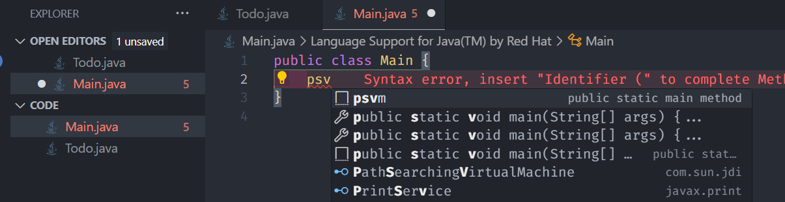
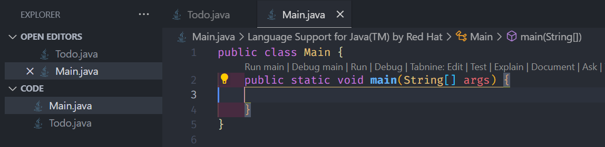

# Rangkuman pertemuan minggu ke-1

> Class, Object, Method, Package, dan Constructor

### Class

- Ketika membuat class, method, konstanta, dll pastikan menggunakan [format penamaan](https://koding.alza.web.id/aturan-penamaan-dalam-bahasa-pemrograman-java/) yang sesuai.
- Dapat membuat beberapa class dalam satu root package, tetapi hanya boleh ada satu method main di dalam satu berkas utama (file utama).
- Setiap class harus berisi atribut dan method. Atribut adalah variabel yang menyimpan data, sedangkan method adalah fungsi yang melakukan aksi tertentu.

Untuk menambahkan method main dengan cepat, dapat menggunakan snippet. Ketikkan **"psvm"** lalu tekan Enter.

Ini akan otomatis menghasilkan struktur method main.

Maka main method akan terbentuk.


### Object

- Object adalah instansiasi dari sebuah class. Setiap Object memiliki sifat dan perilaku yang didefinisikan oleh class tersebut.
- Setelah mendefinisikan class, dapat membuat Object dari class tersebut. Ini dilakukan dengan menggunakan kata kunci **new**, diikuti oleh constructor class.

### Method

- Method adalah fungsi yang didefinisikan di dalam sebuah class. Method digunakan untuk melakukan aksi atau operasi tertentu yang berkaitan dengan object dari class tersebut.
- Terdapat berbagai jenis method, namun saat ini hanya akan mempelajari dua jenis, yaitu:
  - Method Biasa: Method yang memiliki satu nama dan dapat dipanggil untuk melakukan tugas tertentu.
  - Method Overloading: Method yang memiliki nama yang sama tetapi berbeda dalam parameter (jumlah atau tipe parameter).

### Package

- Package adalah kontainer yang digunakan untuk mengelompokkan class yang terkait. Dengan menggunakan package, dapat mengorganisasi kode secara lebih terstruktur dan memudahkan dalam manajemen proyek.
- Package dibagi menjadi dua kategori:
  - Package Bawaan Java (Java API): Merupakan kumpulan class dan interface yang disediakan oleh Java untuk memudahkan pengembangan aplikasi. Contoh package bawaan antara lain **java.util**, **java.io**, dan **java.lang**.
  - Package yang Dibuat Sendiri: Anda dapat membuat package sesuai kebutuhan proyek Anda. Package ini biasanya digunakan untuk mengelompokkan class yang di buat sendiri.

## Contoh source code

#### Todo.java

```Java
public class Todo {
    // Atribut dengan berbagai tingkat akses
    private final String task; // Hanya bisa diakses dari dalam class Todo dan final tidak akan bisa dirubah
                               // setelah di initialisasi
    public String dueDate; // Bisa diakses dari mana saja
    int priority; // Default (package-private), hanya bisa diakses dari dalam package yang sama
    protected String notes; // Bisa diakses dari class Todo dan class turunannya

    // Constructor tanpa parameter
    public Todo() {
        task = "Task belum ditentukan";
        dueDate = "Belum ditentukan";
        priority = 0;
        notes = "Tidak ada catatan";
    }

    // Constructor dengan parameter
    public Todo(String task, String dueDate, int priority, String notes) {
        this.task = task;
        this.dueDate = dueDate;
        this.priority = priority;
        this.notes = notes;
    }

    // Method tanpa overloading
    public void displayInfo() {
        System.out.println("Task: " + task);
        System.out.println("Due Date: " + dueDate);
        System.out.println("Priority: " + priority);
        System.out.println("Notes: " + notes);
    }

    // Method dengan overloading
    public void setPriority(int newPriority) {
        if (newPriority >= 0 && newPriority <= 5) {
            priority = newPriority;
        } else {
            System.out.println("Priority harus antara 0 dan 5.");
        }
    }

    public void setPriority(String priorityLevel) {
        switch (priorityLevel.toLowerCase()) {
            case "low" -> priority = 1;
            case "medium" -> priority = 3;
            case "high" -> priority = 5;
            default -> System.out.println("Priority level tidak valid.");
        }
    }
}
```

#### Main.java

```Java
import java.util.Scanner; // Merupakan package dari Java API

public class Main {
    public static void main(String[] args) {
        // Contoh penggunaan Scanner
        Scanner scanner = new Scanner(System.in);
        System.out.print("Masukkan angka: ");
        int number = scanner.nextInt();
        /*
        method scanner ada bermacam macam salah satu contohnya adalah nextInt.

        (dapat dilihat didalam documentation java, link terlampir)
        */
        System.out.println("Number: " + number);


        // Membuat objek Todo dengan constructor tanpa parameter
        Todo todo1 = new Todo();
        todo1.displayInfo();

        // Membuat objek Todo dengan constructor berparameter
        Todo todo2 = new Todo("Belajar Java", "2023-12-31", 4, "Sangat penting");
        todo2.displayInfo();

        // Menggunakan method overloading
        todo2.setPriority(2);
        todo2.displayInfo();
        todo2.setPriority("high");
        todo2.displayInfo();

        scanner.close();//Scanner harus diclose jika sudah tidak digunakan
    }
}
```

Untuk menjalankan program Java diatas, dikarenakan method main berada di class **Main.java**. Maka dapat melakukan run program di file **MAin.java**.

## Referensi

1.  [Class, Object, Data Type and Constructor](https://github.com/Monashr/PBO-2024-main/blob/master/W01_Class/Materi.md)
2.  [Documentation Java](https://docs.oracle.com/javase/tutorial/java/index.html)
