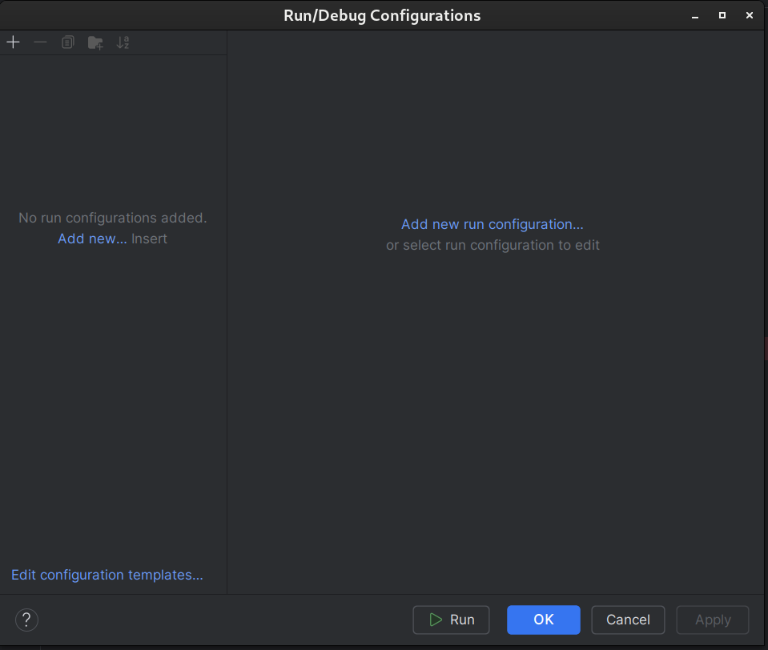

# Tutorial IntelliJ IDEA

## Install IDE

1. Download file installer IDE, terdapat dua versi IntelliJ, yaitu berbayar (Ultimate) dan gratis (Community). Untuk versi berbayar dapat digunakan secara gratis menggunakan lisensi student (gunakan akun SSO untuk registrasi JetBrains account)  

   - [Berbayar](https://www.jetbrains.com/idea/download/)
   - [Gratis (download pada bagian community)](https://www.jetbrains.com/idea/download/other.html)

2. Lakukan installasi IDE seperti biasa (next sampai selesai)
3. Jika menggunakan versi berbayar, login menggunakan akun SSO yang sudah didaftarkan ke Jetbrains account. [Info lisensi student](https://www.jetbrains.com/community/education/#students)
4. IDE siap digunakan

## Cara Membuat Project Baru

1. Buka IDE, kemudian tekan tombol `New Project`, maka akan muncul dialog sebagai berikut.
   
    
   **Hal yang perlu diperhatikan:**  
   - NamaProject ditulis menggunakan `PascalCase`
   - Sebisa mungkin, untuk lokasi penyimpanan tidak ada unsur spasi
   - Build system dapat dipilih bebas, tetapi disarankan menggunakan Maven
   - GroupId diisi sesuai keinginan, sebagai contoh `com.rizalanggoro`. Pastikan tidak ada spasi, dan dapat ditulis menggunakan `camelCase` atau `snake_case`
2. Jika sudah sesuai, tekan tombol `Create` dan tunggu proses loading hingga selesai
3. Jika menggunakan Maven, akan terdapat sebuah file `pom.xml` yang berfungsi sebagai identitas project, serta tempat untuk mendaftarkan dependencies yang akan digunakan. (File ini dapat diabaikan terlebih dahulu)
   
4. Struktur project (Maven) adalah sebagai berikut. Kita bisa menambahkan package, class, file, dll di dalam folder groupId (com.rizalanggoro). File Main.java merupakan endpoint utama dari project yang kita buat
   
5. Pada bagian atas (toolbar) sebelah kiri tombol run terdapat dropdown `Current File`. Hal tersebut berarti ketika kita menekan tombol run, akan menjalankan kode/file saat ini. Sedangkan kita beranggapan bahwa file Main.java merupakan endpoint utama. Oleh karena itu, perlu dilakukan konfigurasi terlebih dahulu
6. Tekan dropdown `Current File` > `Edit Configurations` maka akan muncul dialog `Run/Debug Configurations`.
   
7. Tekan tombol + pada pojok kiri atas, atau button `Add new...` > `Application`
   
8. Akan terdapat sebuah field error (Main class). Tekan tombol `Browse...` kemudian pilih file/class Main. Selanjutnya, tekan `OK` untuk menuntup dialog konfigurasi
   
9. Setelah konfigurasi selesai, kita dapat me-run project menggunakan tombol run (segitiga hijau) pada bagian atas (toolbar). Selesai
