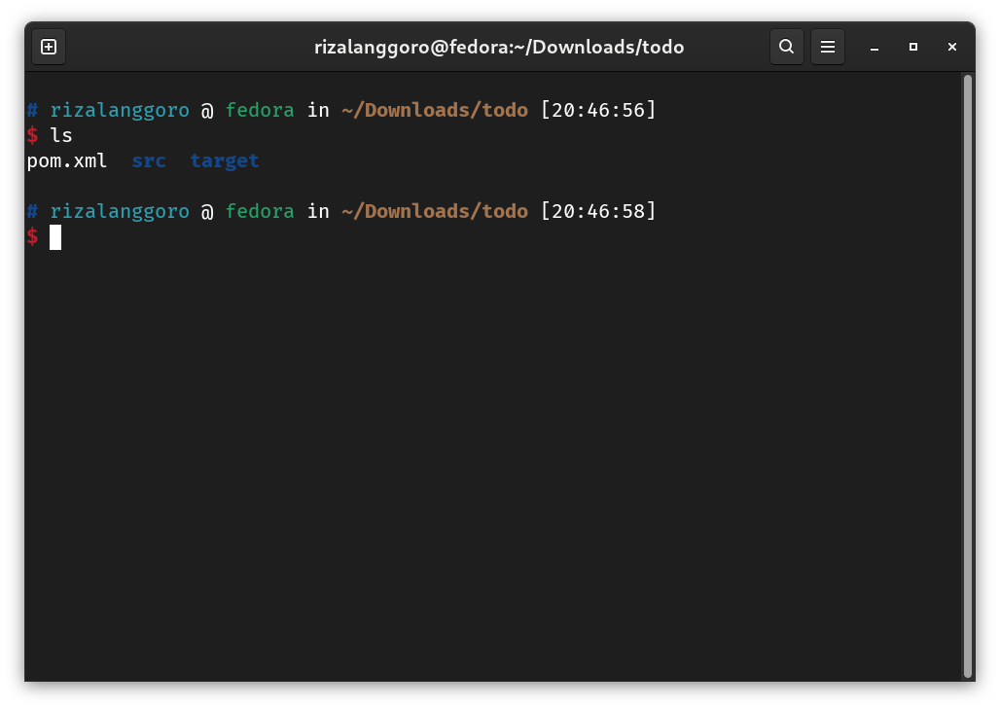
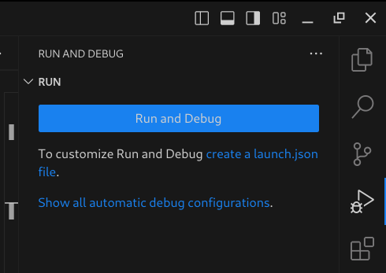

# Tutorial VS Code

## Install VS Code

Bisa lah yaa... 
Kalau ga bisa berarti ga lulus KP

## Membuat Project Baru

1. Buka VSCode
2. Tekan `ctrl+shift+p` maka akan terbuka sebuah command prompt. Cari `> Java: Create Java Project...`
3. Pada bagian project type, pilih `Maven`
4. Pada bagian archetype, pilih `No Archetype...`
5. Pada bagian group id isikan identitas kalian, contoh `com.rizalanggoro` atau `com.rizal.anggoro` gunakan tanda `.` sebagai pemisah setiap kata
6. Pada bagian artifact id isikan nama project kalian. Sebagai contoh adalah `todo`
7. Selanjutnya, akan diarahkan untuk memilih lokasi pembuatan project. Usahakan lokasi project tidak menggandung karakter spasi
8. Untuk membuka project tersebut, buka menggunakan terminal, pastikan sudah berada pada directory project tersebut. Contoh pada gambar berikut ketika menggunakan perintah `ls` akan menampilkan file/folder `pom.xml, src, target`. Jika directory sudah benar, buka VSCode menggunakan perintah `code .`
   
9. Untuk me-run project buka sidebar bagian `RUN AND DEBUG`, kemudian tekan tombol `Run and Debug`. InsyaAllah bisa hehe :v. **KALAU GA BISA CARI TAU**
   
